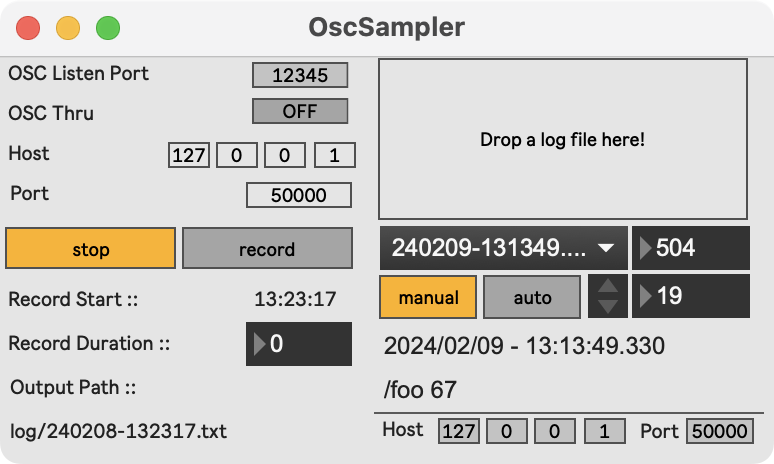
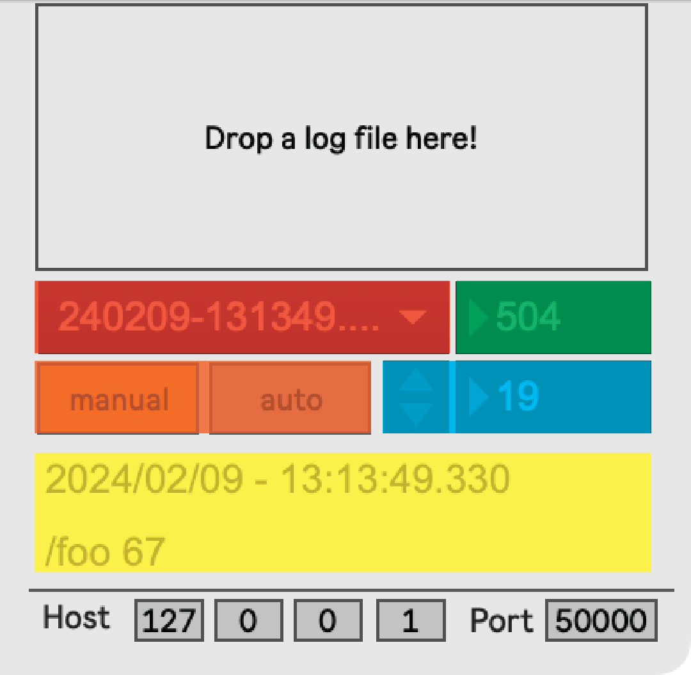

# OscSampler

Record and playback OSC messages.

## Requirements
- [ht.min](https://github.com/hana/ht.min)
    - Download [the package with binaries here](https://github.com/hana/ht.min/releases/tag/1.0.1), and locate in `Max 8/Packages`.

## Usage
### Record
|Param          |Note               |
|----|----| 
|OSC Listen Port|Your incoming port|
|OSC Thru|Turn ON if you want to pass-through the incoming OSC to another client.|
|Host| The pass-through client's IP address.|
|Port| The pass-through client's Port.|
|stop/record| Hit record if you want to record.|

Normally, the recorded log file is saved in `log` folder with `YYYYMMDD-HHMMSS.txt` format, discribing the recording start time. 
The `.txt` files in `log` folder are automatically listed in the menu.

## Play

|Color/Title|Note               |
|----|----| 
|Red|Log files in `log` folder|
|Green|Number of total OSC messages logged in selected .txt file.|
|Orange|`manual/auto` - If manual, OSC message is sent by pressing arrows on the right. Otherwise, OSC messages are transmitted automatically.|
|Blue|Manual arrow and the index of last triggered OSC.|
|Yellow|The time when the last message was logged, and its content.|
|Host|Remote IP to send recorded OSC.|
|Port|And its port.|